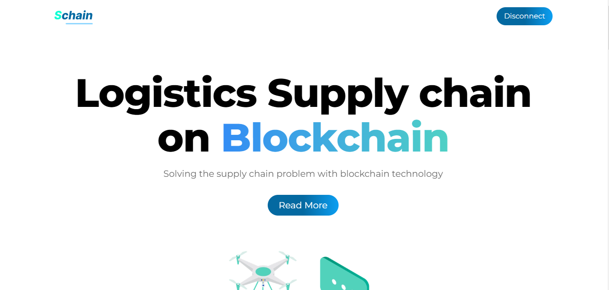

<!-- PROJECT LOGO -->
<br />
<div align="center">
  <a href="https://github.com/othneildrew/Best-README-Template">
    
  </a>

  <h3 align="center">schain</h3>

  <p align="center">
   A supply chain management application on a blockchain
    <br />
    <a href="https://github.com/othneildrew/Best-README-Template"><strong>Explore the docs »</strong></a>
    <br />
    <br />
    <a href="https://schain.vercel.app/">View App</a>
    
  </p>
</div>

<!-- TABLE OF CONTENTS -->
<details>
  <summary>Table of Contents</summary>
  <ol>
    <li>
      <a href="#about-the-project">About The Project</a>
      <ul>
        <li><a href="#built-with">Built With</a></li>
      </ul>
    </li>
    <li>
      <a href="#getting-started">Getting Started</a>
      <ul>
        <li><a href="#prerequisites">Prerequisites</a></li>
        <li><a href="#installation">Installation</a></li>
      </ul>
    </li>
    <li><a href="#contributing">Contributing</a></li>
    <li><a href="#license">License</a></li>
    <li><a href="#contact">Contact</a></li>
    <li><a href="#acknowledgments">Acknowledgments</a></li>
  </ol>
</details>

<!-- ABOUT THE PROJECT -->

## About The Project



Welcome to Schain`, your number one platform to track your order along the supply chain process on the blockchain.

We're dedicated to giving you the very best of your order, with focus from time of order and every other updates about the order as it moves along the processes of the supply chain all happening on the blockchain.

Founded in 2022, by Sympodium, Schain` has come a long way from its beginnings in Ghana. When Albert, Sarkodie and Brilliant first started out with Schain, the passion for solving supply chain problems with blockchain drove them to undertake several researches so that Schain can offer the very best services it does now along the supply chain of many organizations here in Ghana and abroad and we are thrilled that we are able to turn our passion into such a revolutionary solution in supply chain.

There are about six (6) user types (that is customer, administrator, manager, manufacturer, tester and transporter) that is captured on the platform. Among the six (6) types, user cannot perform an activity of the other user type unless assigned to that role by the administrator.
The customer only can make an order(s) and track them as they move along the supply chain process on the blockchain to get updated. The customer can also add reviews on an order and also cancel an order. Below are steps the customer can undertake to make an order:

1. Connect to the app with preferred wallet.
2. Click on the "add order button" and fill in the details of the order.
3. Click on the order to view the supply chain process or the state of your order.

The Administrator is the user in charge of assigning roles to other users as user type to undertake an action in the supply chain. These roles assigned to a user type, can be overridden by assigning same role to another user of different account. The Administrator can as well add products to the platform by adding the product media, the price of the product and any other details which all will be available to customers.
to access the admin panel use the following;
username:"admin"
password: "63CkBcD{B),M;h2>"

The Manager is the first user type in the supply chain process to approve an order(s) as received to be set up for the next step in the supply chain process.

The Manufacturer undertake his or her activities with regards to an order(s) and then confirms it once done for the next step of the supply chain process.

The Tester undertakes testing activities with regards to an order(s) and then confirms it for the next step of the supply chain process.

The Transporter undertake dispatching activities with regards to an order(s) to be delivered to customers. And once delivered to the customer, he or she confirms the delivery.

All these processes can be seen by the customer with regards to an order(s). And once the customer receives the item, he or she has the liberty to accept the orders or return it.

### Built With

This section should list any major frameworks/libraries used to bootstrap your project. Leave any add-ons/plugins for the acknowledgements section. Here are a few examples.

- [Next.js](https://nextjs.org/)
- [React.js](https://reactjs.org/)
- [TailwindCSS.js](https://tailwindcss.com/)
- [Solidity.js](https://docs.soliditylang.org/)
- [Typescript.js](https://www.typescriptlang.org/)
- [Express.js](https://expressjs.com/)
- [IPFS](https://ipfs.io/)
<!-- GETTING STARTED -->

## Getting Started

The project consist of the backend and also the front end.

### Prerequisites

- nodejs installed

- npm
  ```sh
  npm install npm@latest -g
  ```

### Local setup

To run this project locally, follow these steps.

1. Clone the project locally, change into the directory, and install the dependencies:

```sh
git clone https://github.com/mendsalbert/schain

cd schain

# install using NPM or Yarn
npm install

# or

yarn
```

2. Start the local Hardhat node

```sh
npx hardhat node
```

3. With the network running, deploy the contracts to the local network in a separate terminal window

```sh
npx hardhat run scripts/deploy.js --network localhost
```

4. Start the app

```
npm run dev
```

### Configuration

To deploy to Polygon test or main networks, update the configurations located in **hardhat.config.js** to use a private key and, optionally, deploy to a private RPC like Infura.

```javascript
/* hardhat.config.js */
require("@nomiclabs/hardhat-waffle");
const fs = require("fs");
const privateKey = fs.readFileSync("secret.txt").toString();

const projectId = "745fcbe1f649402c9063fa946fdbb84c";
module.exports = {
  defaultNetwork: "hardhat",
  networks: {
    hardhat: {
      chainId: 1337,
    },
    //  unused configuration commented out for now

    kovan: {
      url: "https://kovan.infura.io/v3/745fcbe1f649402c9063fa946fdbb84c",
      accounts: [privateKey],
      gas: 2100000,
      gasPrice: 8000000000,
    },
  },
  solidity: {
    version: "0.8.4",
    settings: {
      optimizer: {
        enabled: true,
        runs: 200,
      },
    },
  },
};
```

If using Infura, update **.infuraid** with your [Infura](https://infura.io/) project ID.

<!-- USAGE EXAMPLES -->

<!-- ROADMAP -->

<p align="right">(<a href="#top">back to top</a>)</p>

<!-- CONTRIBUTING -->

## Contributing

Contributions are what make the open source community such an amazing place to learn, inspire, and create. Any contributions you make are **greatly appreciated**.

If you have a suggestion that would make this better, please fork the repo and create a pull request. You can also simply open an issue with the tag "enhancement".
Don't forget to give the project a star! Thanks again!

1. Fork the Project
2. Create your Feature Branch (`git checkout -b feature/AmazingFeature`)
3. Commit your Changes (`git commit -m 'Add some AmazingFeature'`)
4. Push to the Branch (`git push origin feature/AmazingFeature`)
5. Open a Pull Request

<!-- LICENSE -->

## License

Distributed under the MIT License.

<!-- CONTACT -->

## Contact

Mends Albert - [@mendsalbert](https://twitter.com/mendalbert) - mendsalbert@gmail.com

Brilliant Kwakye - [@a_moah\_\_](https://twitter.com/mendalbert)

Daniel Sarkodie - [@AbrantepaSark](https://twitter.com/mendalbert)

Project Link: [https://github.com/mendsalbert/sympodiumCoin](https://github.com/mendsalbert/sympodiumCoin)

<!-- ACKNOWLEDGMENTS -->

## Acknowledgments

Use this space to list resources you find helpful and would like to give credit to. I've included a few of my favorites to kick things off!

- [Choose an Open Source License](https://choosealicense.com)
- [GitHub Emoji Cheat Sheet](https://www.webpagefx.com/tools/emoji-cheat-sheet)
- [Malven's Flexbox Cheatsheet](https://flexbox.malven.co/)
- [Malven's Grid Cheatsheet](https://grid.malven.co/)
- [Img Shields](https://shields.io)
- [GitHub Pages](https://pages.github.com)
- [Font Awesome](https://fontawesome.com)
- [React Icons](https://react-icons.github.io/react-icons/search)

<!-- MARKDOWN LINKS & IMAGES -->
<!-- https://www.markdownguide.org/basic-syntax/#reference-style-links -->

[contributors-shield]: https://img.shields.io/github/contributors/othneildrew/Best-README-Template.svg?style=for-the-badge
[contributors-url]: https://github.com/othneildrew/Best-README-Template/graphs/contributors
[forks-shield]: https://img.shields.io/github/forks/othneildrew/Best-README-Template.svg?style=for-the-badge
[forks-url]: https://github.com/othneildrew/Best-README-Template/network/members
[stars-shield]: https://img.shields.io/github/stars/othneildrew/Best-README-Template.svg?style=for-the-badge
[stars-url]: https://github.com/othneildrew/Best-README-Template/stargazers
[issues-shield]: https://img.shields.io/github/issues/othneildrew/Best-README-Template.svg?style=for-the-badge
[issues-url]: https://github.com/othneildrew/Best-README-Template/issues
[license-shield]: https://img.shields.io/github/license/othneildrew/Best-README-Template.svg?style=for-the-badge
[license-url]: https://github.com/othneildrew/Best-README-Template/blob/master/LICENSE.txt
[linkedin-shield]: https://img.shields.io/badge/-LinkedIn-black.svg?style=for-the-badge&logo=linkedin&colorB=555
[linkedin-url]: https://linkedin.com/in/othneildrew
[product-screenshot]: images/screenshot.png

#
