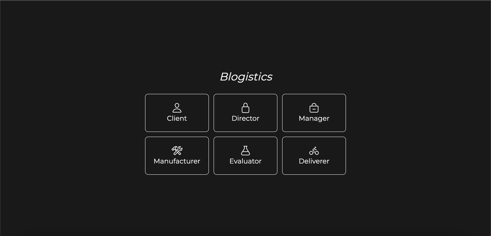

<p align="center">

</p>
<h1 align="center">🌟 Blogistics 🌟</h1>
<p align="center">
We would like to introduce Blogistics, a decentralize logistics platform that take supply chain management on the blockchain to provide security and transparrency.
</p>

<p align="center">
<a href="https://github.com/gonormonor/Blogistics/blob/master/LICENSE" title="License">

</a>
<a href="https://github.com/gonormonor/Blogistics/fork" title="Forks">

</a>
<a href="https://github.com/gonormonor/Blogistics" title="Stars">

</a>
<a href="https://img.shields.io/github/stars/gonormonor/Blogistics/issues" title="Issues">

</a>

</a>
</p>

<p align="center" title="Project Initiator"></p>

<h2 align="center">🌐 Links 🌐</h2>
<p align="center">
    <a href="https://youtu.be/ud4P45zhCk0" title="">🖥️ Video</a>
    .
    <a href="https://youtu.be/ud4P45zhCk0" title="">🔗 Website</a>
    ·
    <a href="https://github.com/gonormonor/Blogistics" title="">📂 Repo</a>
    ·
    <a href="https://github.com/gonormonor/Blogistics" title="🐛Report Bug/🎊Request Feature">🚀 Got Issue</a>
</p>

## 💪 What is Blogistics

Blogistics is a blockchain-based logistics platform that enables secure and transparent supply chain management. By decentralizing the supply chain management process on the blockchain, Blogistics provides a higher level of security and transparency, as well as immutability.

By using Blogistics, businesses will be able to enjoy a higher level of security and transparency in their supply chain management process. In addition, the platform is also immutable, which means that once data is entered into the blockchain, it cannot be changed or tampered with. This provides businesses with a higher level of confidence in the accuracy of the data. by a third party.

## 🚀 How it works

Blogistics works by tracking and verifying the movement of goods through the supply chain on the blockchain. This process is secure and transparent, and enables businesses to track the progress of their goods through the supply chain in real-time.

The key features of Blogistics include:

- **Secure and transparent: The platform uses blockchain technology to track and verify the movement of goods through the supply chain, providing a higher level of security and transparency.**

- **Immutable: The data stored on the blockchain is immutable, which means that it cannot be changed or tampered with. This provides businesses with a higher level of confidence in the accuracy of the data.**

- **Real-time tracking: The platform enables businesses to track the progress of their goods through the supply chain in real-time.**

## 🎊 What are the use cases of Blogistics?

The platform can be used for a variety of supply chain management applications, such as:

Tracking the movement of goods through the supply chain

Verifying the authenticity of goods

Tracking the progress of production

Managing inventory

## 🦋 Prerequisite

- [Nodejs](https://nodejs.org/en// "Node") Installed

- [Git](https://git-scm.com/ "Git OFficial") Installed

- [npm](https://www.npmjs.com/ "npm ") Installed

- [Hardhat](https://hardhat.org/ "Hardhat ") Installed

## 🛠️ Installation Steps

1. Clone the repository

```Bash
git clone https://github.com/gonormonor/Blogistics
```

2. Change the working directory

```Bash
cd Blogistics
```

3. Start the local Hardhat node

```Bash
npx hardhat node
```

4. With the network running, deploy the contracts to the local network in a separate terminal window

```Bash
npx hardhat run scripts/deploy.js --network localhost
```

5. Start the app

```Bash
npm run start
```

**🎇 You are Ready to Go!**

## ⚙️ Configuration

The chain ID should be 80001. If you have a localhost rpc set up, you may need to overwrite it.

<p align="center" title="Project Initiator"></p>

To deploy to Polygon test or main networks, update the configurations located in hardhat.config.js to use a private key and, optionally, deploy to a private RPC like Infura.

```Bash
require('@nomiclabs/hardhat-waffle');
const privateKey = 'xxx';
const projectId = 'xx';

module.exports = {
  defaultNetwork: 'hardhat',
  networks: {
    hardhat: {
      chainId: 1337,
    },
    matic: {
      url: 'https://polygon-mumbai.g.alchemy.com/v2/{projectId}',
      accounts: [privateKey],
    },
  },
  solidity: {
    version: '0.8.4',
    settings: {
      optimizer: {
        enabled: true,
        runs: 200,
      },
    },
  },
};
```

## 👷 Built with

- [Solidity](https://docs.soliditylang.org/en/v0.8.17/ "Solidity"): as Main Coding Language for writing smart contract

- [ReactJs](https://reactjs.org/ "React Js"): as Main Coding Language for Creating The UI components (Front End)

- [TailwindCss](https://tailwindcss.com/ "Tailwind Css"): as Main Coding Language for styling UI components

- [IPFS](https://ipfs.tech/ "IPFS"): For Storing of files

- [Web3 Storage](https://www.google.com/search?q=web3storage "Web3 Storage"): For Storing of files

- [Moralis](https://moralis.io/ "Moralis"): as Tool for creating the chat section

- [Github](https://github.com/ "Github") : For Repo Storage and source code management

- [Git](https://git-scm.com/ "Git") : For Version Control System

- [Quick Node](https://www.quicknode.com "QuickNode") : Blockchain related APIs

## 📂 Contributing

Contributions are what make the open source community such an amazing place to learn, inspire, and create. Any contributions you make are greatly appreciated.

If you have a suggestion that would make this better, please fork the repo and create a pull request. You can also simply open an issue with the tag "enhancement". Don't forget to give the project a star! Thanks again!

- Fork the Project

- Create your Feature Branch (git checkout -b feature/AmazingFeature)

- Commit your Changes (git commit -m 'Add some AmazingFeature')

- Push to the Branch (git push origin feature/AmazingFeature)

- Open a Pull Request

## 🧑🏻 Author

**Gonor Monor**

- 🌌 [Profile](https://github.com/gonormonor "Gonor Monor")

- 🏮 [Email](gonormonor@gmail.com "Hi!")

<h2 align="center">🤝 Support</h2>

<p align="center">🎀 Contributions (<a href="https://guides.github.com/introduction/flow" title="GitHub flow">GitHub Flow</a>), 🔥 issues, and 🥮 feature requests are most welcome!</p>

<p align="center">💙 If you like this project, Give it a ⭐ and Share it with friends!</p>

<p align="center">Made with Solidity and Javascript & ❤️ </p>
